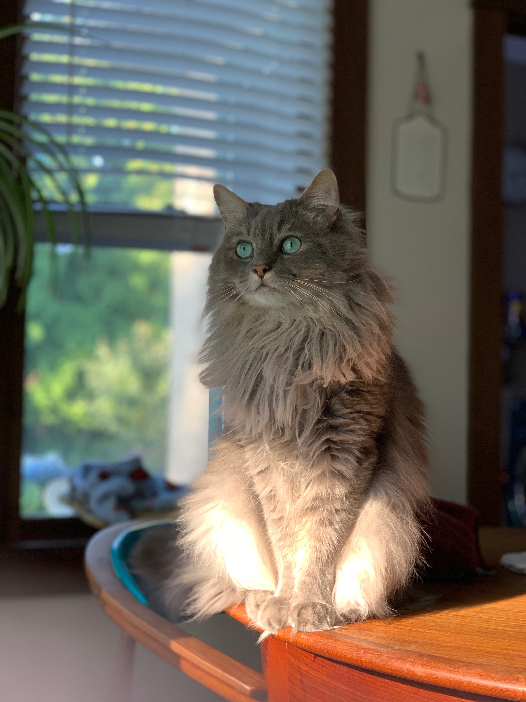

\
\
\
\
\
\
meow

## About

Hi! I am a first year PhD student in the Department of Statistics & Data Science at Carnegie Mellon University. I recently finished my MS in Statistics at the University of Pittsburgh, where I worked under the supervision of [Lucas Mentch](lucasmentch.com). I am broadly interested in creating inferential procedures for machine learning modeling methods, as well as developing accessible statistical tools that are applicable to natural and social science research. 